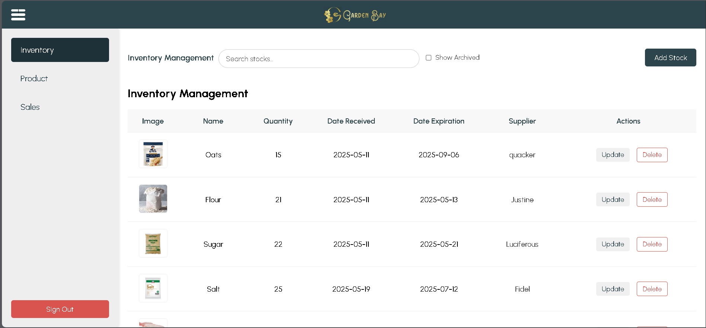
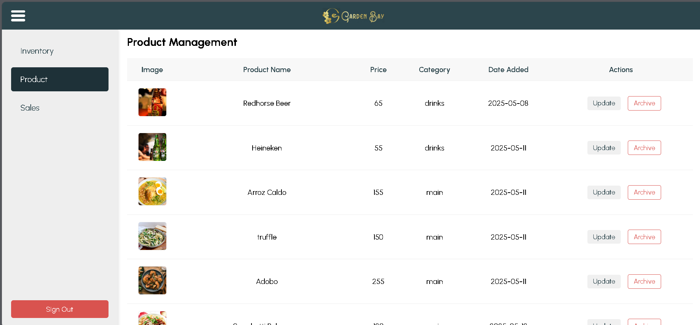
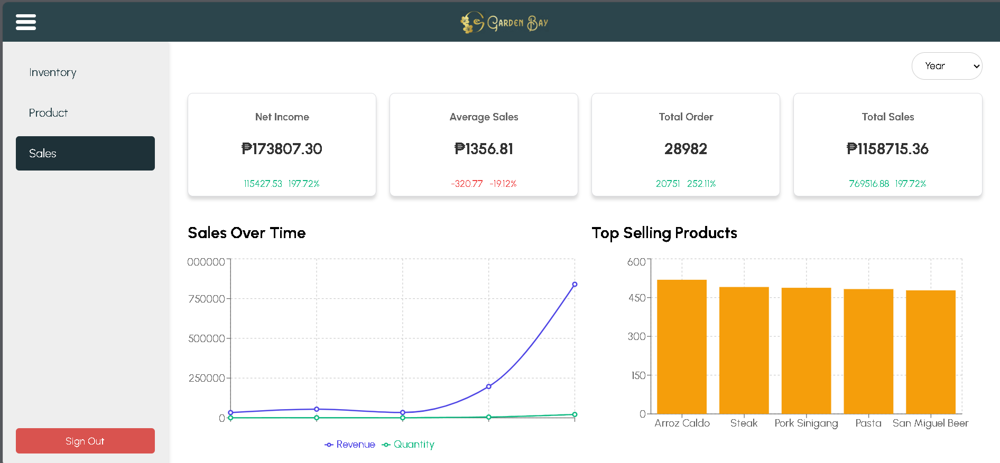
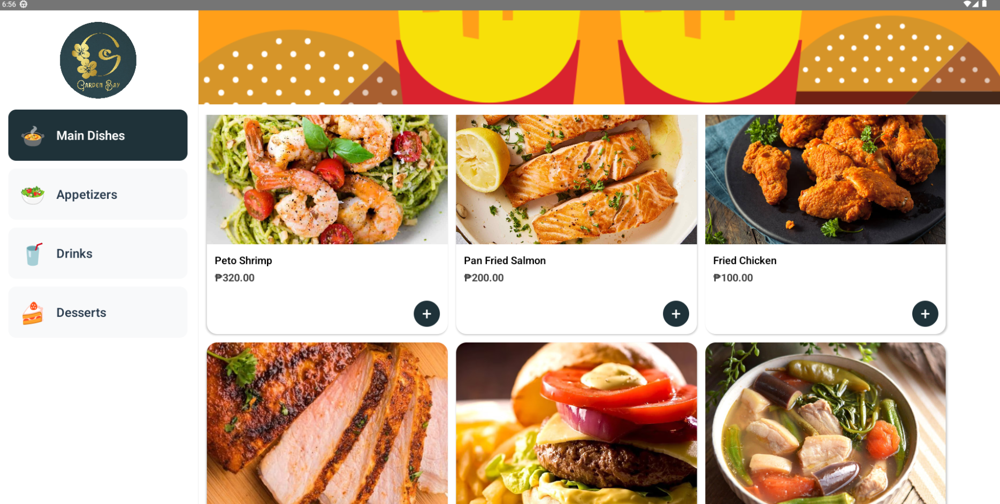
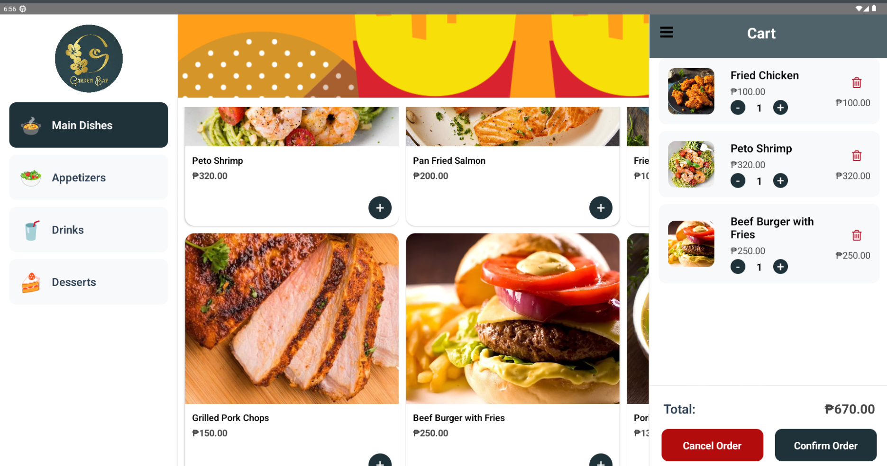
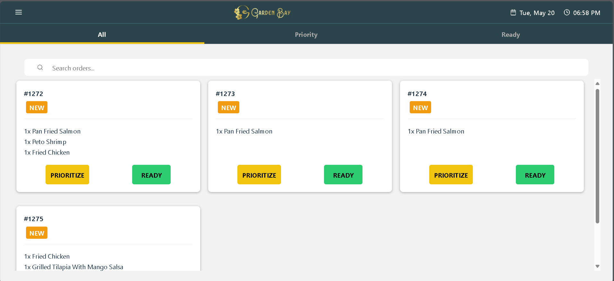
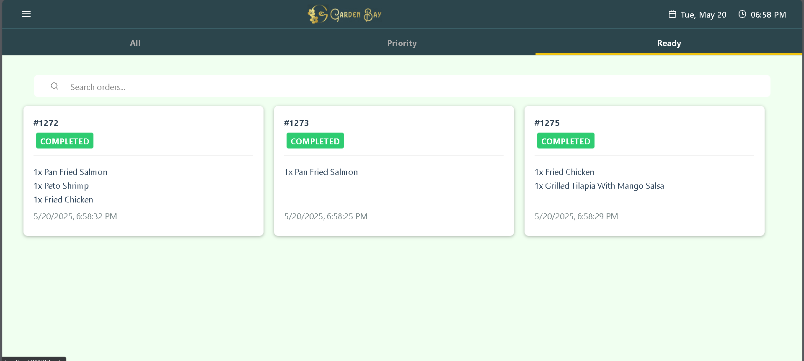

🌿🍽️ Garden Bay Integrated System Monorepo  
An all-in-one kiosk-based ordering for Garden Bay Restaurant, designed to improve customer convenience and optimize operational efficiency.
This is the official monorepo for the Restaurant Management System project.

🧾 About the Project
The Garden Bay Integrated System is a full-featured digital solution comprising:

A React Native-based kiosk ordering application for customers to browse the menu and place orders directly from a tablet.
A React-based Inventory management system, product management and sales analytics.
A Laravel MVC backend to handle business logic, data storage, and API services.

Ordering System (Kiosk App)  
📱 Tablet-optimized UI  
🍔 Browse categorized menu items  
🛒 Add to cart and checkout  
🔄 Real-time order sync with backend  

Admin Panel  
🔒 User authentication  
🧑‍🍳 Manage menu items and inventory stock items  
📊 View real-time Sales analytics

Kitchen Display  
🍳 Real-time kitchen display of new orders and preparation monitoring.  
📦 Change order status to priority and ready.  
📦 Audible sound effect to notify the servers of completed orders.  

🛠 Tech Stack
| Frontend     | Backend      | 
| ------------ | ------------ |
| React Native | Laravel MVC  | 
| React        | SQLite       |
| Tailwind CSS |              |
| Typescript   |              |

⚙️ Installation  
git clone --recurse-submodules https://github.com/LordByron00/Garden-Bay-Intergrated-System.git  
or  
git clone https://github.com/LordByron00/Garden-Bay-Intergrated-System.git  
git submodule init  
git submodule update  

cd Garden-Bay-Backend  
composer install  
cp .env.example .env  
php artisan key:generate  
php artisan migrate  
php artisan serve  

cd Garden-Bay-Admin-Systems and Garden-Bay-Kitchen-Display-System  
npm install  
npm run start  

cd Garden-Bay-Ordering-System  
npx react-native run-android # or run-ios  

▶️ Usage  
Launch the backend server and ensure the database is running.  
Run the Garden-Bay-Ordering-System kiosk app on a tablet device or emulator.  
Run the Garden-Bay-Admin-Systems app on a tablet device or emulator.  
Run the Garden-Bay-Kitchen-Display-Systems.  

📸 Screenshots  
ADMIN SYSTEM  

ORDERING SYSTEM (KIOSK)

KITCHEN DISPLAY SYSTEM

👨‍💻 Contributors  
Luciferous Grandeur – Full Stack Developer / System Integrator /  QA Tester  
Erron Madelo – Front-End developer

